# 🚀 Remise TP - Mission Spatiale Linux
**Nom :** Roy
**Prénom :** Alexandre
**Date :** 16 février 2026

## 🚀 PHASE 1 : PRISE DE CONTRÔLE

### Question 1 : Identité utilisateur et privilèges
**Énoncé :** Affichez votre identité d'utilisateur actuel et vos privilèges pour confirmer que vous avez bien l'accès administrateur.

**Capture d'écran :**
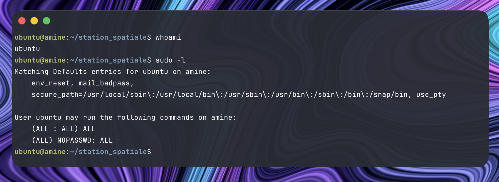

### Question 2 : Contenu de la station
**Énoncé :**  Listez TOUT le contenu de la station spatiale, y compris les fichiers cachés et le contenu des sous-répertoires de façon récursive.

**Capture d'écran :**
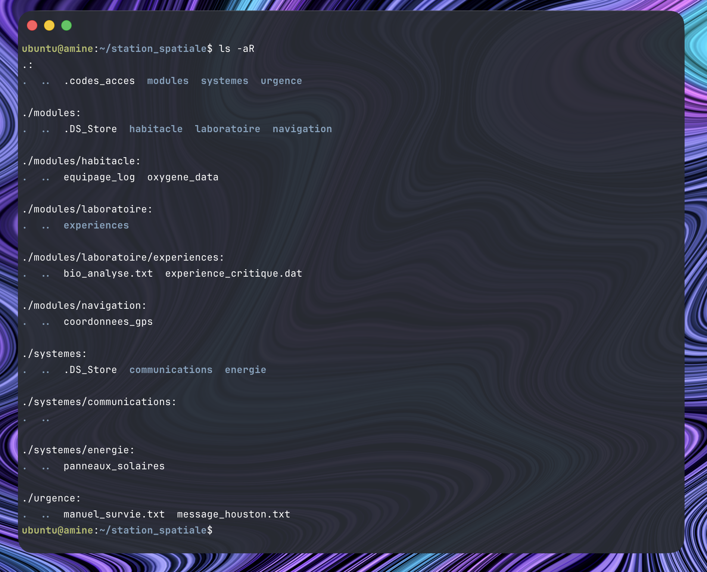

### Question 3 : Panneaux déconnectés
**Énoncé :** Les panneaux solaires semblent déconnectés ! Vérifiez le contenu du module energie avec les permissions détaillées.

**Capture d'écran :**
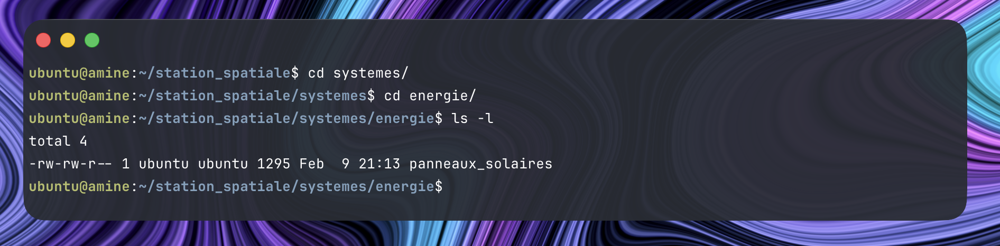

### Question 4 : Création Arborescence
**Énoncé :** Créez en une seule commande l'arborescence suivante dans le module communications :

```bash
communications/
├── antenne_principale/
│   ├── transmetteur/
│   └── recepteur/
├── antenne_secours/
└── satellites/
    ├── gps/
    └── internet/
```

**Capture d'écran :**
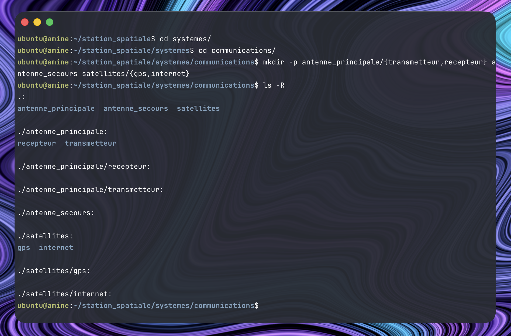

### Question 5 : Création de 50 fichiers
**Énoncé :** L'équipage a besoin de 50 canaux de communication d'urgence. Créez en une commande 50 fichiers nommés canal_urgence_1, canal_urgence_2, ... canal_urgence_50 dans le répertoire antenne_principale.

**Capture d'écran :**
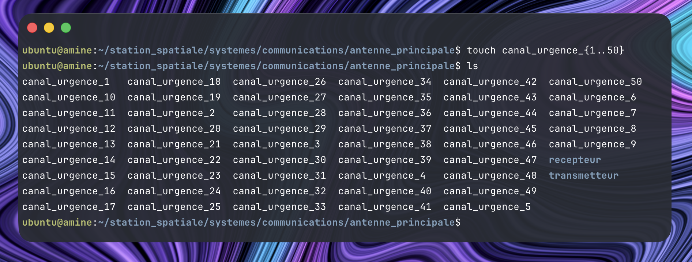

### Question 6 : Copiage du laboratoire
**Énoncé :** Copiez tout le contenu du répertoire laboratoire vers un nouveau répertoire laboratoire_backup dans le module urgence.

**Capture d'écran :**
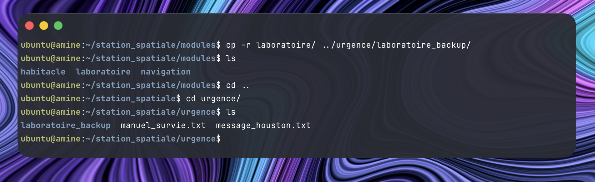

### Question 7 : Suppression du répertoire
**Énoncé :** L'expérience principale a été corrompue ! Supprimez complètement le répertoire experiences du laboratoire original (pas de la sauvegarde).

**Capture d'écran :**


### Question 8 : Navigation
**Énoncé :** Naviguez vers le module habitacle et vérifiez votre position actuelle.

**Capture d'écran :**


### Question 9 : Renommage de fichier
**Énoncé :** Les données d'oxygène sont critiques ! Renommez le fichier oxygene_data en oxygene_CRITIQUE_backup.data.

**Capture d'écran :**
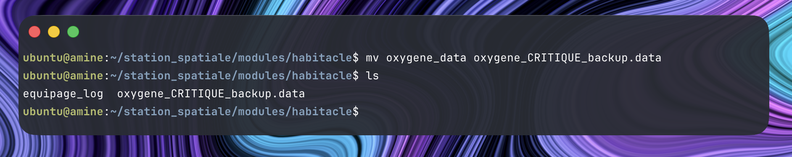

## 🛰️ PHASE 2 : RÉPARATION DES LIENS SYSTÈME

### Question 10 : Lien symbolique
**Énoncé :** Créez un lien symbolique appelé panneaux_solaires dans le répertoire racine qui pointe vers systemes/energie/panneaux_solaires.

**Capture d'écran :**
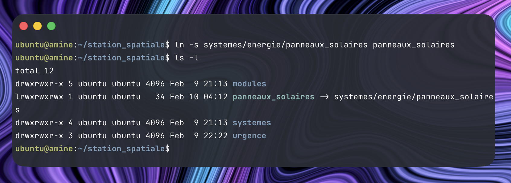

### Question 11 : Vérification du lien
**Énoncé :** Affichez le contenu du répertoire racine avec les numéros d'inodes pour vérifier votre lien symbolique.

**Capture d'écran :**
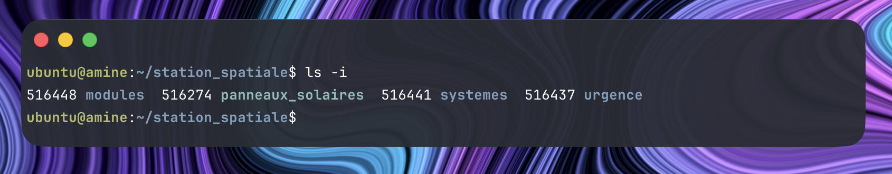

### Question 12 : Suppression d'un répertoire
**Énoncé :** Les panneaux solaires doivent être surveillés depuis le poste de commande. Depuis le répertoire racine, supprimez le répertoire energie et tout son contenu.

**Capture d'écran :**
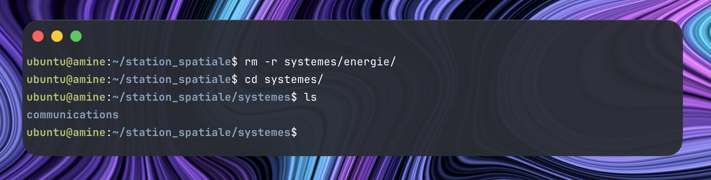

### Question 13 : Remarques
**Énoncé :** Que remarquez-vous concernant votre lien symbolique maintenant ? (Question théorique - pas de capture)

**Réponse :** Le lien que je viens de créer ne fonctionne plus, car le dossier qui se fesais pointer viens d'être supprimé.

### Question 14 : Création d'un fichier
**Énoncé :** Créez un fichier coordonnees_terre dans le module navigation.

**Capture d'écran :**
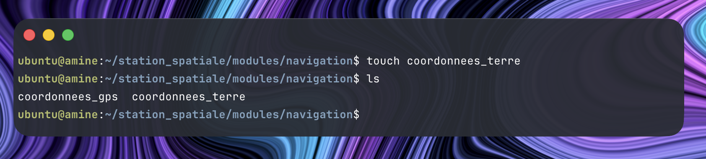

### Question 15 : Navigation
**Énoncé :** Retournez dans le répertoire principal de la station spatiale en utilisant un chemin relatif depuis navigation.

**Capture d'écran :**
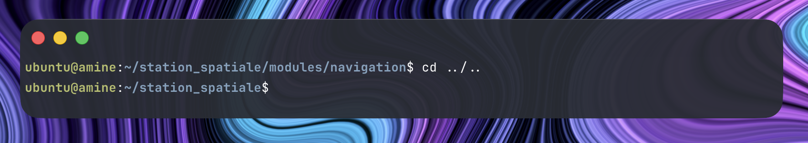

### Question 16 : Mon nom
**Énoncé :** Affichez deux commandes différentes qui montrent votre nom d'utilisateur.

**Capture d'écran :**
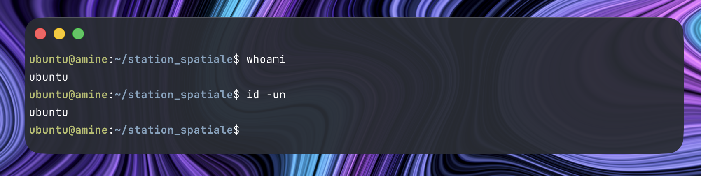

### Question 17 : Mon répertoire
**Énoncé :** Affichez votre répertoire de travail actuel.

**Capture d'écran :**
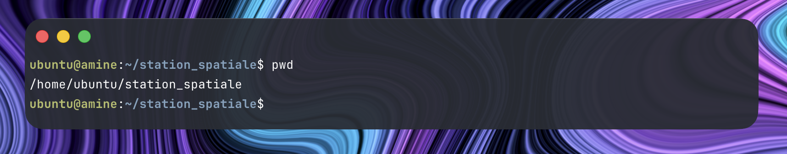

### Question 18 : Date et heure
**Énoncé :** Affichez l'heure et la date actuelles (importantes pour la synchronisation orbital).

**Capture d'écran :**
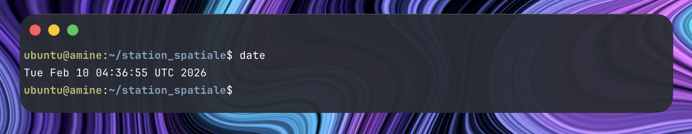

### Question 19 : Infos OS
**Énoncé :** Affichez les informations complètes sur votre système d'exploitation.

**Capture d'écran :**
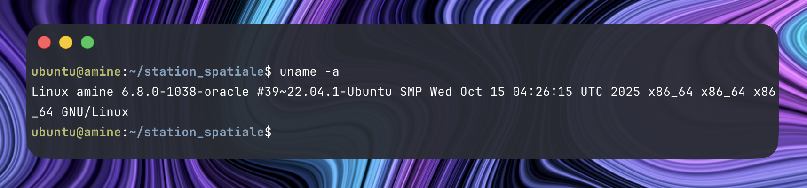

## 🔐 PHASE 3 : SÉCURISATION DES ACCÈS

### Question 20 : Permissions avec la notation symbolique
**Énoncé :** Le fichier .codes_acces contient les codes secrets de la station. Modifiez ses permissions pour que SEUL le propriétaire puisse le lire, l'écrire et l'exécuter. Utilisez la notation symbolique.

**Capture d'écran :**
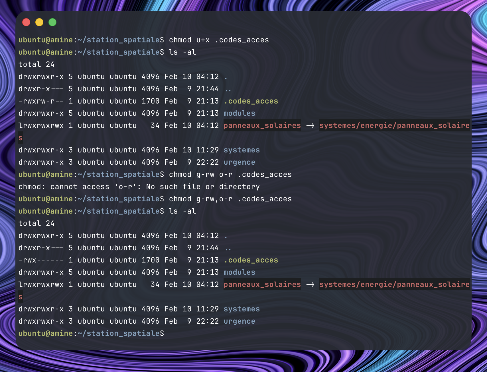

### Question 21 : Permissions avec la notion octale
**Énoncé :** Changez maintenant les permissions de .codes_acces pour qu'il ait les permissions 700 (propriétaire seul avec tous les droits) en utilisant la notation octale.

**Capture d'écran :**
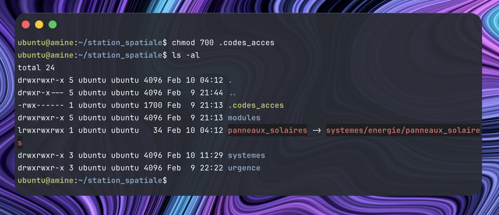

### Question 22 : Ajout du bit SUID
**Énoncé :** Le fichier de log de l'équipage doit pouvoir être exécuté par le système. Ajoutez le bit SUID au fichier equipage_log. Utilisez la méthode de votre choix.

**Capture d'écran :**
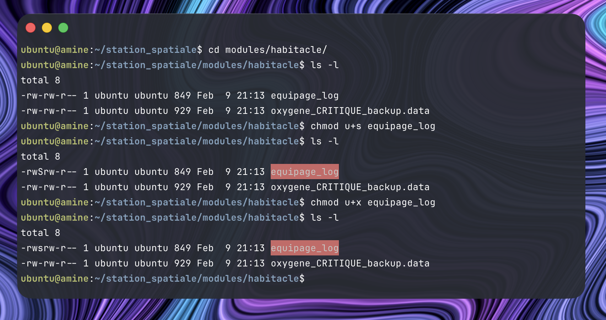

### Question 23 : Exécution d'un script
**Énoncé :** Exécutez le script ./.codes_acces. Cela devrait créer un nouveau module salle_controle avec un fichier acces_total à l'intérieur.

**Capture d'écran :**
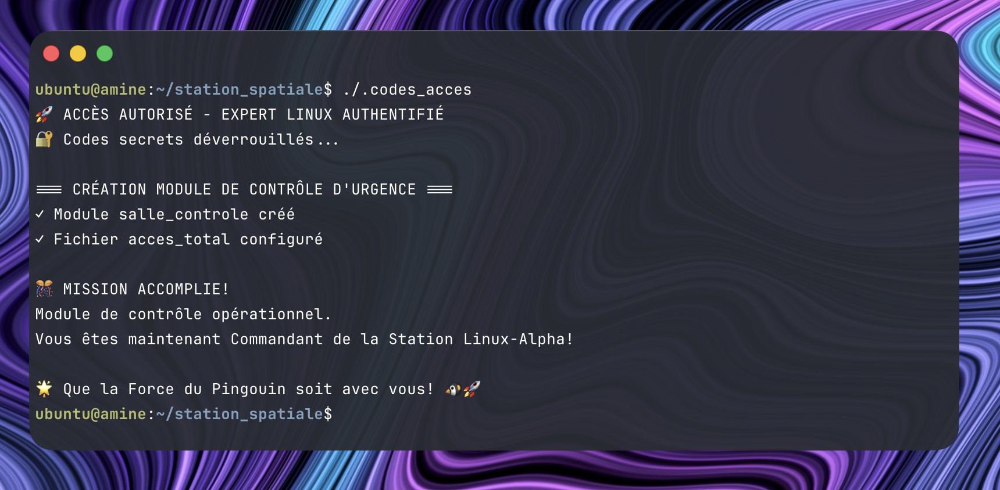

### Question 24 : Affichage de permissions
**Énoncé :** Affichez le masque de permissions par défaut (umask) actuel.

**Capture d'écran :**
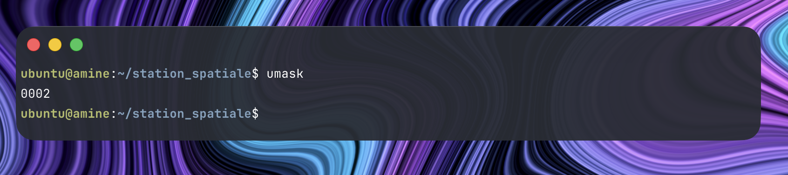

### Question 25 : Configuration d'un masque
**Énoncé :** Configurez un nouveau masque de permissions pour que seul le propriétaire ait tous les droits sur les nouveaux fichiers créés.

**Capture d'écran :**
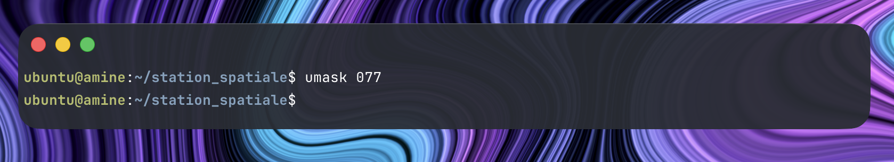

### Question 26 : Vérification
**Énoncé :** Vous êtes maintenant le commandant de la station ! Vérifiez que vous êtes bien propriétaire du fichier acces_total et affichez ses permissions détaillées pour confirmer votre contrôle total.

**Capture d'écran :**
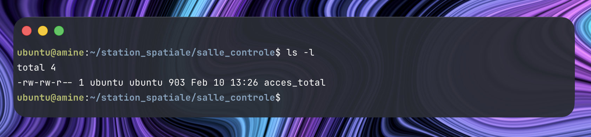

### Question 27 : Mode root
**Énoncé :** Basculez en mode root et chargez l'environnement complet de l'administrateur.

**Capture d'écran :**
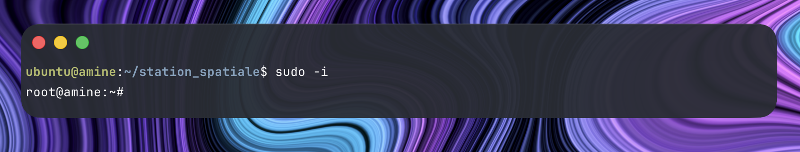


## 👨‍🚀 PHASE 4 : GESTION D'ÉQUIPAGE D'URGENCE

